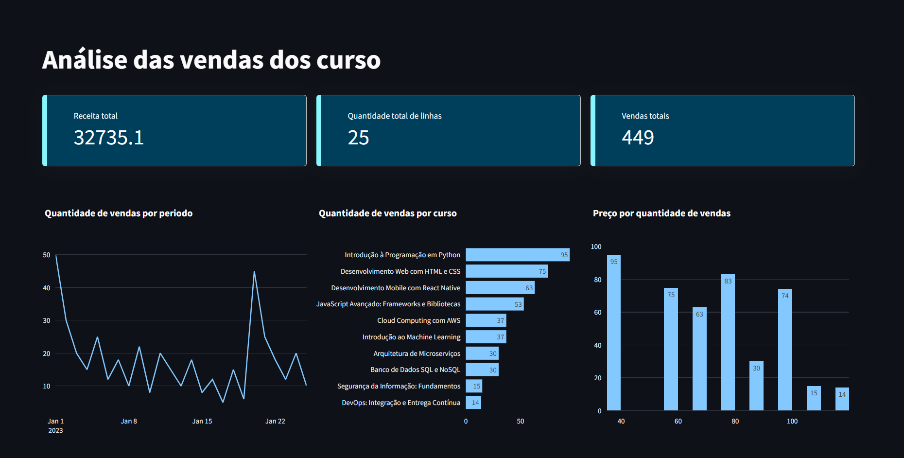

# 📚 Trilha Inicial Ciência de Dados Jr
Este projeto tem como objetivo realizar uma análise básica de dados utilizando Python, explorando um conjunto de dados pré-definido para extrair insights simples através de estatísticas descritivas e visualizações gráficas.

# Projeto
Este é um projeto da trilha inicial do Codigo Certo, onde foi realizado uma análise dos dados das vendas de cursos, utilizando o streamlit para a construção de um dashboard e um jupyter nootebok para fazer uma análise simples em cima dos dados.

# O dashboard


O relatório faz a análise da receita total das vendas dos cursos, a quantidade de linhas e o total de vendas. Além da visualização da quantidade de vendas por periodo, quais cursos foram mais vendidos e o preço por quantidade de vendas, podendo compreender que quanto mais caro o curso menor a quantidade de venda dele.

### Tecnologias e bibliotecas usadas
* Python
* Streamlit
* Plotly
* Pandas

## Instalação

Para instalar as dependências, execute o seguinte comando no terminal:


```bash
pip install -r requirements.txt
```

## Utilização

1. Faça o clone desse repositório.
2. Instale as dependências.
3. Utilize ````streamlit run main.py```` para rodar o programa.

## Conecte-se comigo:

- [Portfólio](https://yasmim-portifolio.vercel.app)
- [Linkedin](https://www.linkedin.com/in/yasmim-abrahao-311491227/)
